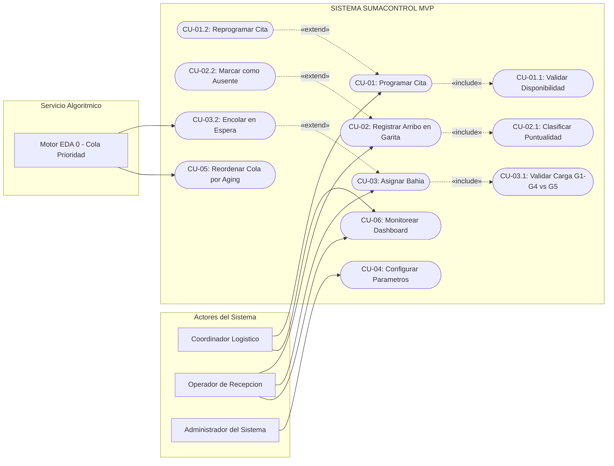

```mermaid
flowchart LR

    subgraph Actores [Actores del Sistema]
        Coord[Coordinador Logistico]
        Oper[Operador de Recepcion]
        Admin[Administrador del Sistema]
    end

    subgraph Sistema [SISTEMA SUMACONTROL MVP]
        CU01([CU-01: Programar Cita])
        CU01_1([CU-01.1: Validar Disponibilidad])
        CU01_2([CU-01.2: Reprogramar Cita])

        CU02([CU-02: Registrar Arribo en Garita])
        CU02_1([CU-02.1: Clasificar Puntualidad])
        CU02_2([CU-02.2: Marcar como Ausente])

        CU03([CU-03: Asignar Bahia])
        CU03_1([CU-03.1: Validar Carga G1-G4 vs G5])
        CU03_2([CU-03.2: Encolar en Espera])

        CU04([CU-04: Configurar Parametros])
        CU05([CU-05: Reordenar Cola por Aging])
        CU06([CU-06: Monitorear Dashboard])
    end

    subgraph Algoritmo [Servicio Algoritmico]
        MotorEDA[Motor EDA 0 - Cola Prioridad]
    end

    %% Relaciones Include (Obligatorias)
    CU01 -.->|«include»| CU01_1
    CU02 -.->|«include»| CU02_1
    CU03 -.->|«include»| CU03_1

    %% Relaciones Extend (Excepciones / Flujos Opcionales)
    CU01_2 -.->|«extend»| CU01
    CU02_2 -.->|«extend»| CU02
    CU03_2 -.->|«extend»| CU03

    %% Conexiones de Actores a Casos de Uso
    Coord --> CU01
    Coord --> CU06

    Oper --> CU02
    Oper --> CU03
    Oper --> CU06

    Admin --> CU04

    MotorEDA --> CU03_2
    MotorEDA --> CU05
```
