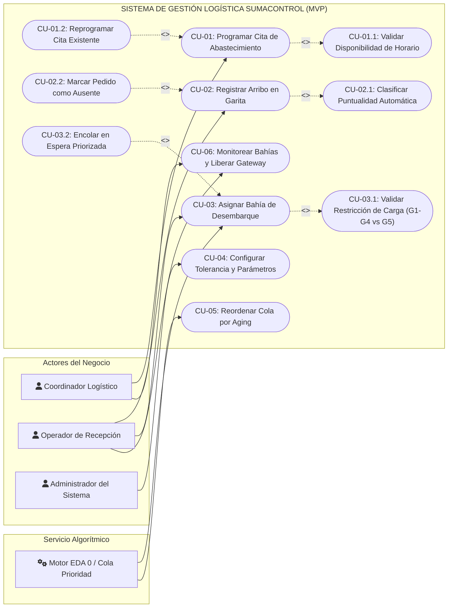

# Diagrama General de Casos de Uso (UML) - SumaControl MVP

```mermaid
flowchart LR
    %% Actores Humanos
    subgraph ACTORES_HUMANOS [Actores del Negocio]
        Coordinador["fa:fa-user Coordinador Logístico"]
        Operador["fa:fa-user Operador de Recepción"]
        Admin["fa:fa-user Administrador del Sistema"]
    end

    %% Límite del Sistema
    subgraph SYSTEM_BOUNDARY ["SISTEMA DE GESTIÓN LOGÍSTICA SUMACONTROL (MVP)"]
        CU01(["CU-01: Programar Cita de Abastecimiento"])
        CU01_1(["CU-01.1: Validar Disponibilidad de Horario"])
        CU01_2(["CU-01.2: Reprogramar Cita Existente"])

        CU02(["CU-02: Registrar Arribo en Garita"])
        CU02_1(["CU-02.1: Clasificar Puntualidad Automática"])
        CU02_2(["CU-02.2: Marcar Pedido como Ausente"])

        CU03(["CU-03: Asignar Bahía de Desembarque"])
        CU03_1(["CU-03.1: Validar Restricción de Carga (G1-G4 vs G5)"])
        CU03_2(["CU-03.2: Encolar en Espera Priorizada"])

        CU04(["CU-04: Configurar Tolerancia y Parámetros"])
        CU05(["CU-05: Reordenar Cola por Aging"])
        CU06(["CU-06: Monitorear Bahías y Liberar Gateway"])
    end

    %% Actor de Sistema (Algoritmo)
    subgraph ACTOR_SISTEMA [Servicio Algorítmico]
        MotorEDA["fa:fa-cogs Motor EDA 0 / Cola Prioridad"]
    end

    %% Relaciones de CU-01
    Coordinador --> CU01
    CU01 -.->|"<<include>>"| CU01_1
    CU01_2 -.->|"<<extend>>"| CU01

    %% Relaciones de CU-02
    Operador --> CU02
    CU02 -.->|"<<include>>"| CU02_1
    CU02_2 -.->|"<<extend>>"| CU02

    %% Relaciones de CU-03
    Operador --> CU03
    MotorEDA --> CU03
    CU03 -.->|"<<include>>"| CU03_1
    CU03_2 -.->|"<<extend>>"| CU03

    %% Relaciones de CU-04, 05, 06
    Admin --> CU04
    MotorEDA --> CU05
    Coordinador --> CU06
    Operador --> CU06
```
